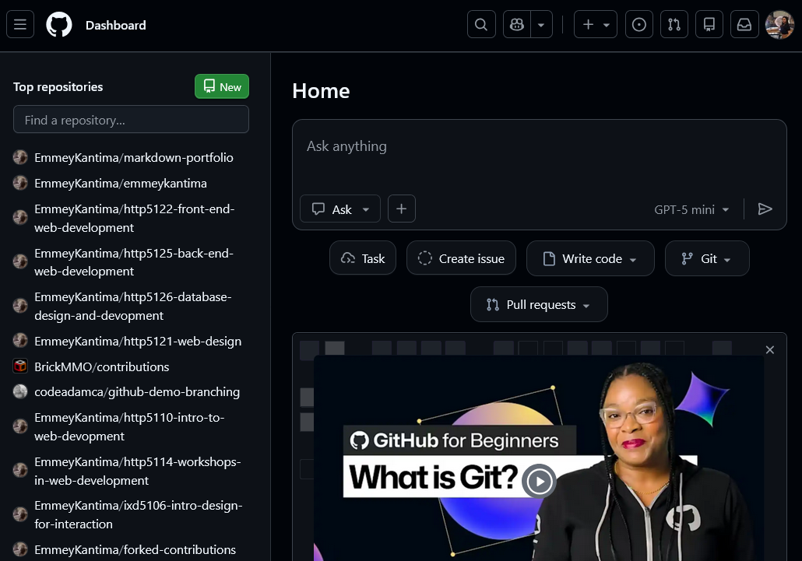

# http5114-Workshops
Class content from Workshops in Web Development

***HTTP5114 - Workshops in Web Development*** is a class that will train you using supporting tools that help web development by providing tools for writing code such as GitHub or StackOverflow.

- [Github](https://github.com/)
- [Stackoverflow](https://stackoverflow.com/)

>![NOTE]
>- format terminal
>- VS code